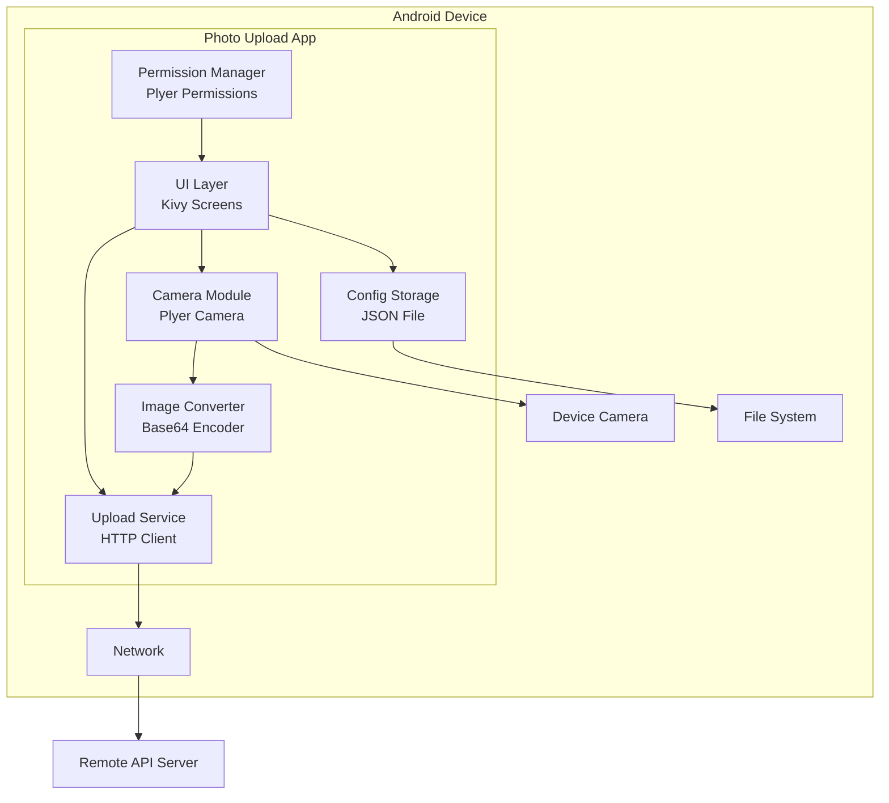
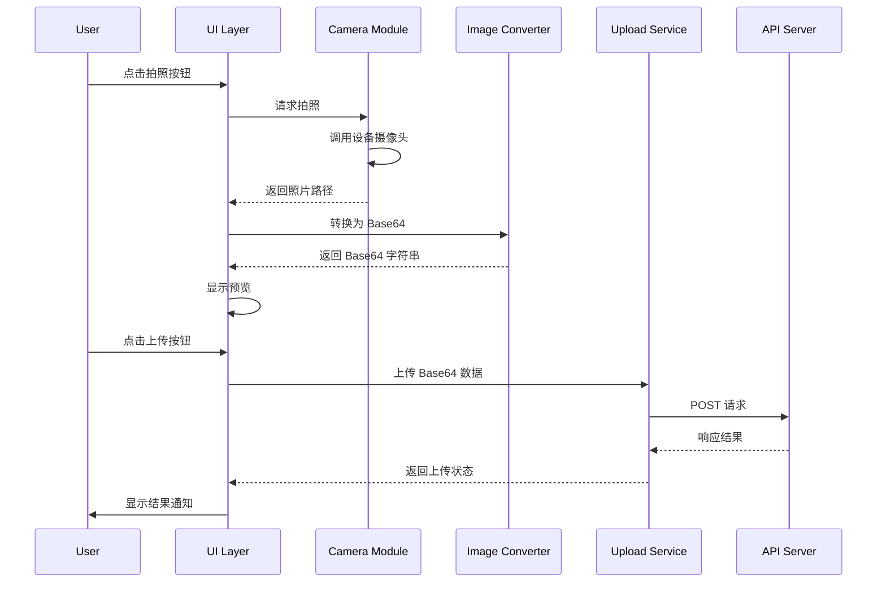

# Design Document

## Overview

本设计文档描述了一个基于 Python Kivy 框架开发的 Android 拍照上传应用。应用使用 Kivy 作为跨平台 UI 框架，Plyer 库访问设备硬件功能（摄像头），并通过 Buildozer 打包为 Android APK。

### 技术栈

- **UI 框架**: Kivy 2.x
- **硬件访问**: Plyer (camera, permissions)
- **HTTP 请求**: requests 库
- **打包工具**: Buildozer
- **目标平台**: Android 8.0+ (API 26+)

## Architecture



### 数据流



## Components and Interfaces

### 1. UI Layer (main.py)

主应用类，管理屏幕和用户交互。

```python
class PhotoUploadApp(App):
    """主应用类"""
    
    def build(self) -> Widget:
        """构建应用 UI"""
        pass
    
    def on_start(self) -> None:
        """应用启动时请求权限"""
        pass

class MainScreen(Screen):
    """主屏幕，包含拍照和上传功能"""
    
    def capture_photo(self) -> None:
        """触发拍照"""
        pass
    
    def upload_photo(self) -> None:
        """触发上传"""
        pass
    
    def show_preview(self, image_path: str) -> None:
        """显示照片预览"""
        pass
    
    def show_notification(self, message: str, is_error: bool = False) -> None:
        """显示通知消息"""
        pass

class SettingsScreen(Screen):
    """设置屏幕，配置 API 端点"""
    
    def load_config(self) -> None:
        """加载当前配置"""
        pass
    
    def save_config(self, api_url: str) -> bool:
        """保存配置"""
        pass
```

### 2. Camera Module (camera_module.py)

负责摄像头操作。

```python
class CameraModule:
    """摄像头模块"""
    
    def __init__(self, save_path: str):
        """初始化，设置照片保存路径"""
        pass
    
    def capture(self, callback: Callable[[str], None]) -> None:
        """
        拍照并通过回调返回照片路径
        
        Args:
            callback: 拍照完成后的回调函数，参数为照片路径
        """
        pass
    
    def is_available(self) -> bool:
        """检查摄像头是否可用"""
        pass
```

### 3. Image Converter (image_converter.py)

负责图片与 Base64 之间的转换。

```python
class ImageConverter:
    """图片转换器"""
    
    @staticmethod
    def encode_to_base64(image_path: str) -> Result[str, str]:
        """
        将图片文件编码为 Base64 字符串
        
        Args:
            image_path: 图片文件路径
            
        Returns:
            Result: 成功返回 Base64 字符串，失败返回错误信息
        """
        pass
    
    @staticmethod
    def decode_from_base64(base64_string: str, output_path: str) -> Result[str, str]:
        """
        将 Base64 字符串解码为图片文件
        
        Args:
            base64_string: Base64 编码的字符串
            output_path: 输出文件路径
            
        Returns:
            Result: 成功返回输出路径，失败返回错误信息
        """
        pass
```

### 4. Upload Service (upload_service.py)

负责与 API 通信。

```python
@dataclass
class UploadResult:
    """上传结果"""
    success: bool
    message: str
    response_data: Optional[dict] = None

class UploadService:
    """上传服务"""
    
    def __init__(self, api_url: str):
        """初始化，设置 API 端点"""
        pass
    
    def upload_image(self, base64_data: str, filename: str = "photo.jpg") -> UploadResult:
        """
        上传 Base64 编码的图片
        
        Args:
            base64_data: Base64 编码的图片数据
            filename: 文件名
            
        Returns:
            UploadResult: 上传结果
        """
        pass
    
    def set_api_url(self, api_url: str) -> None:
        """更新 API 端点"""
        pass
```

### 5. Config Storage (config_storage.py)

负责配置持久化。

```python
@dataclass
class AppConfig:
    """应用配置"""
    api_url: str = ""

class ConfigStorage:
    """配置存储"""
    
    def __init__(self, config_path: str):
        """初始化，设置配置文件路径"""
        pass
    
    def load(self) -> AppConfig:
        """加载配置"""
        pass
    
    def save(self, config: AppConfig) -> bool:
        """保存配置"""
        pass
    
    @staticmethod
    def validate_url(url: str) -> bool:
        """验证 URL 格式"""
        pass
```

### 6. Permission Manager (permission_manager.py)

负责 Android 权限管理。

```python
class PermissionManager:
    """权限管理器"""
    
    @staticmethod
    def request_camera_permission(callback: Callable[[bool], None]) -> None:
        """请求摄像头权限"""
        pass
    
    @staticmethod
    def request_storage_permission(callback: Callable[[bool], None]) -> None:
        """请求存储权限"""
        pass
    
    @staticmethod
    def check_camera_permission() -> bool:
        """检查摄像头权限"""
        pass
    
    @staticmethod
    def check_storage_permission() -> bool:
        """检查存储权限"""
        pass
```

## Data Models

### AppConfig

```python
@dataclass
class AppConfig:
    """应用配置数据模型"""
    api_url: str = ""
    
    def to_dict(self) -> dict:
        return {"api_url": self.api_url}
    
    @classmethod
    def from_dict(cls, data: dict) -> "AppConfig":
        return cls(api_url=data.get("api_url", ""))
```

### UploadResult

```python
@dataclass
class UploadResult:
    """上传结果数据模型"""
    success: bool
    message: str
    response_data: Optional[dict] = None
```

### PhotoData

```python
@dataclass
class PhotoData:
    """照片数据模型"""
    file_path: str
    base64_data: Optional[str] = None
    timestamp: Optional[str] = None
```


## Correctness Properties

*A property is a characteristic or behavior that should hold true across all valid executions of a system-essentially, a formal statement about what the system should do. Properties serve as the bridge between human-readable specifications and machine-verifiable correctness guarantees.*

### Property 1: Base64 Round-Trip Consistency

*For any* valid image byte sequence, encoding to Base64 and then decoding back to bytes SHALL produce the original byte sequence.

**Validates: Requirements 2.1, 2.2, 2.3**

### Property 2: URL Validation Correctness

*For any* input string, the URL validator SHALL return true if and only if the string conforms to a valid HTTP/HTTPS URL format (scheme, host, optional port and path).

**Validates: Requirements 4.2**

### Property 3: Configuration Persistence Round-Trip

*For any* valid AppConfig object, saving to storage and then loading from storage SHALL produce an equivalent AppConfig object.

**Validates: Requirements 4.3**

## Error Handling

### Camera Errors

| Error Condition | Handling Strategy |
|----------------|-------------------|
| Camera unavailable | Display error dialog with message "摄像头不可用，请检查权限设置" |
| Camera permission denied | Display permission explanation dialog |
| Photo capture failed | Display error notification and allow retry |

### Network Errors

| Error Condition | Handling Strategy |
|----------------|-------------------|
| No network connection | Display "网络连接不可用，请检查网络设置" |
| API timeout (30s) | Display "上传超时，请重试" |
| API error response | Display server error message to user |
| Invalid API URL | Display "API 地址格式无效" |

### File Errors

| Error Condition | Handling Strategy |
|----------------|-------------------|
| File not found | Display "照片文件不存在" |
| File read error | Display "无法读取照片文件" |
| Storage permission denied | Display permission explanation dialog |

## Testing Strategy

### Property-Based Testing

使用 **Hypothesis** 库进行属性测试。

**配置要求:**
- 每个属性测试运行最少 100 次迭代
- 使用 `@settings(max_examples=100)` 装饰器

**属性测试列表:**

1. **Base64 Round-Trip Test**
   - 生成随机字节序列（模拟图片数据）
   - 验证 encode → decode 返回原始数据
   - 标注: `**Feature: photo-upload-app, Property 1: Base64 Round-Trip Consistency**`

2. **URL Validation Test**
   - 生成随机字符串和有效/无效 URL
   - 验证验证器正确分类所有输入
   - 标注: `**Feature: photo-upload-app, Property 2: URL Validation Correctness**`

3. **Config Persistence Test**
   - 生成随机有效配置对象
   - 验证 save → load 返回等价对象
   - 标注: `**Feature: photo-upload-app, Property 3: Configuration Persistence Round-Trip**`

### Unit Testing

使用 **pytest** 进行单元测试。

**测试范围:**

1. **ImageConverter 单元测试**
   - 测试有效图片文件编码
   - 测试无效文件路径处理
   - 测试空文件处理

2. **ConfigStorage 单元测试**
   - 测试配置保存和加载
   - 测试配置文件不存在时的默认值
   - 测试 URL 验证边界情况

3. **UploadService 单元测试**
   - 测试成功上传响应处理
   - 测试错误响应处理
   - 测试网络超时处理（使用 mock）

### 测试文件结构

```
tests/
├── __init__.py
├── test_image_converter.py      # ImageConverter 单元测试
├── test_config_storage.py       # ConfigStorage 单元测试
├── test_upload_service.py       # UploadService 单元测试
├── test_properties.py           # 属性测试
└── conftest.py                  # pytest 配置和 fixtures
```
